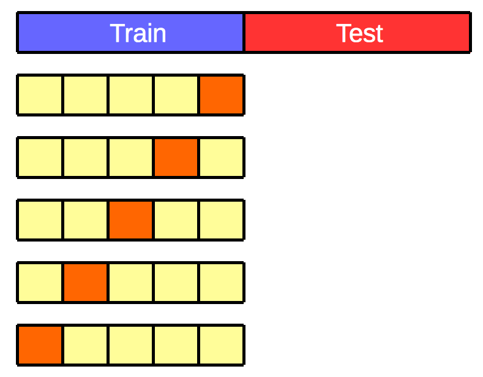

An introduction to caret
========================================================
author:
date:
autosize: true
transition: rotate
css: custom.css

Classification And Regression Trees
========================================================
The caret package was developed by Max Kuhn to:
- create a unified interface for modeling and prediction (interfaces to over 200 models)
- streamline model tuning using resampling
- provide a variety of “helper” functions and classes for day–to–day model building tasks
increase computational efficiency using parallel processing

<https://www.r-project.org/conferences/useR-2013/Tutorials/kuhn/user_caret_2up.pdf>

Why we need caret
========================================================

|obj Class  |Package |predict Function Syntax                  |
|:----------|:-------|:----------------------------------------|
|lda        |MASS    |predict(obj) (no options needed)         |
|glm        |stats   |predict(obj, type = "response")          |
|gbm        |gbm     |predict(obj, type = "response", n.trees) |
|mda        |mda     |predict(obj, type = "posterior")         |
|rpart      |rpart   |predict(obj, type = "prob")              |
|Weka       |RWeka   |predict(obj, type = "probability")       |
|LogitBoost |caTools |predict(obj, type = "raw", nIter)        |


https://www.r-project.org/conferences/useR-2013/Tutorials/kuhn/user_caret_2up.pdf


Available Models
========================================================

<https://topepo.github.io/caret/available-models.html>


CARET Workflow
========================================================
type:section

CARET Workflow
========================================================

- required packages
- example data set
- partition data
- assess data quality
- model tuning
- model comparison
- making predictions using model

Packages
=======================================================
Load **CARET** package

```r
library(caret)
```

Other required packages are **doMC** (parallel processing) and **corrplot** (correlation matrix plots):

```r
library(doMC)
library(corrplot)
```

Example data set
=======================================================
type:section

Wheat seeds data set
=======================================================
The seeds data set https://archive.ics.uci.edu/ml/datasets/seeds contains morphological measurements on the kernels of three varieties of wheat: Kama, Rosa and Canadian.

Load the data into your R session using:


```r
load("data/wheat_seeds/wheat_seeds.Rda")
```
What objects have been loaded into our R session?

```r
ls()
```

```
[1] "morphometrics" "variety"      
```

Wheat seeds data set: predictors
======================================================
The **morphometrics** data.frame contains seven variables describing the morphology of the seeds.

```r
str(morphometrics)
```

```
'data.frame':	210 obs. of  7 variables:
 $ area        : num  15.3 14.9 14.3 13.8 16.1 ...
 $ perimeter   : num  14.8 14.6 14.1 13.9 15 ...
 $ compactness : num  0.871 0.881 0.905 0.895 0.903 ...
 $ kernLength  : num  5.76 5.55 5.29 5.32 5.66 ...
 $ kernWidth   : num  3.31 3.33 3.34 3.38 3.56 ...
 $ asymCoef    : num  2.22 1.02 2.7 2.26 1.35 ...
 $ grooveLength: num  5.22 4.96 4.83 4.8 5.17 ...
```

Wheat seeds data set: class labels
======================================================
The class labels of the seeds are in the factor **variety**.

```r
summary(variety)
```

```
Canadian     Kama     Rosa 
      70       70       70 
```

Partition data
======================================================
type:section

Training and test set
======================================================


Partition data into training and test set
======================================================

```r
set.seed(42)
trainIndex <- createDataPartition(y=variety, times=1, p=0.7, list=F)

varietyTrain <- variety[trainIndex]
morphTrain <- morphometrics[trainIndex,]

varietyTest <- variety[-trainIndex]
morphTest <- morphometrics[-trainIndex,]
```

Class distributions are balanced across the splits
====================================================
Training set

```r
summary(varietyTrain)
```

```
Canadian     Kama     Rosa 
      49       49       49 
```

Test set

```r
summary(varietyTest)
```

```
Canadian     Kama     Rosa 
      21       21       21 
```


Resources
========================================================

- Manual: http://topepo.github.io/caret/index.html

- JSS Paper: http://www.jstatsoft.org/v28/i05/paper

- Book: http://appliedpredictivemodeling.com


